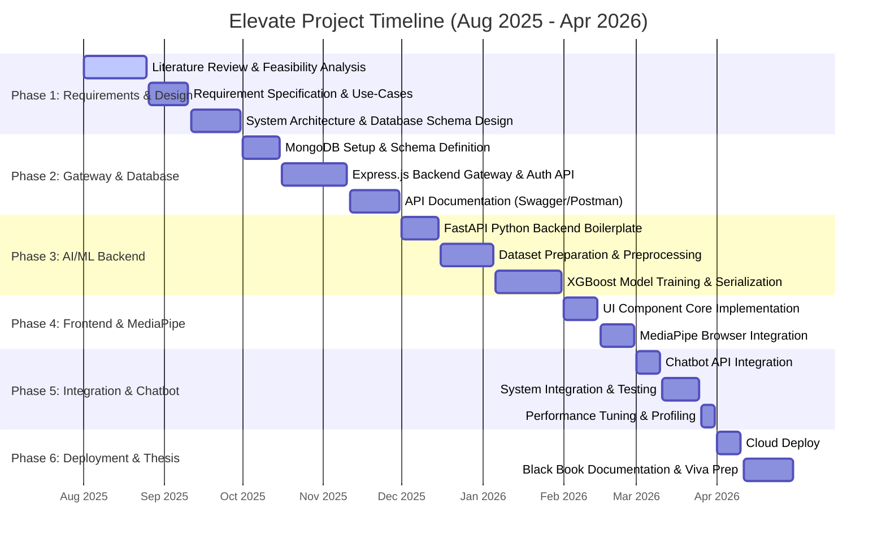

# Project Planner & Gantt Chart: Elevate (Fitness App)

This document contains the project planning phases, Work Breakdown Structure (WBS), and Gantt chart representations for the **Elevate** final-year project report ("Black Book"). The timeline spans 9 months from **August 2025 to April 2026**.

---

## 1.8 Project Execution Plan

The project execution was planned in structured phases over the academic year 2025-2026:

| Phase | Activity | Description | Duration |
| :--- | :--- | :--- | :--- |
| I | Requirement Analysis & Design | Problem identification, literature review, feasibility study, and system architecture design | August - September 2025 |
| II | Backend & Database Development | MongoDB schema design, Express.js API gateway setup, and JWT authentication routing | October - November 2025 |
| III | Machine Learning Pipeline | Dataset preprocessing, FastAPI setup, and XGBoost model training and serialization | December 2025 - January 2026 |
| IV | Frontend & Tracking Integration | React dashboard implementation and MediaPipe real-time pose tracking integration | February 2026 |
| V | System Integration & Testing | Chatbot API integration, end-to-end system validation, and performance optimization | March 2026 |
| VI | Deployment & Documentation | Cloud deployment, final Black Book report writing, and viva defense preparation | April 2026 |

---


---

## 2. Interactive Gantt Chart (Mermaid.js)

The following Mermaid diagram renders a visual Gantt chart of the project lifecycle.



---

## 2. Project Schedule Matrix (Monthly View)

Below is a tabular representation of the 9-month development process mapping tasks to specific months.

| Phase & Core Activity | Aug 25 | Sep 25 | Oct 25 | Nov 25 | Dec 25 | Jan 26 | Feb 26 | Mar 26 | Apr 26 |
| :--- | :---: | :---: | :---: | :---: | :---: | :---: | :---: | :---: | :---: |
| **Phase 1: Requirements & Architecture Design** | █ | █ | | | | | | | |
| **Phase 2: MERN Gateway & Database Core** | | | █ | █ | | | | | |
| **Phase 3: Python FastAPI & ML Model Training** | | | | | █ | █ | | | |
| **Phase 4: React UI & MediaPipe Joint Tracking** | | | | | | | █ | | |
| **Phase 5: Gemini Chatbot & Integration Testing** | | | | | | | | █ | |
| **Phase 6: Deployment & Thesis Compilation** | | | | | | | | | █ |

---

## 3. Work Breakdown Structure (WBS) Details

This detailed timeline lists tasks, durations, start/end dates, dependencies, and deliverables.

### Phase 1: Requirements Engineering & System Design
* **Timeline:** August 1, 2025 – September 30, 2025 (61 Days)
* **Objective:** Establish the theoretical foundations, analyze academic papers, specify requirements, and design the system architecture.

| Task ID | Task Description | Start Date | End Date | Duration (Days) | Dependencies | Deliverables |
| :--- | :--- | :--- | :--- | :---: | :--- | :--- |
| **1.1** | Literature Review & Feasibility Analysis | 2025-08-01 | 2025-08-25 | 25 | None | Survey of existing posture tracking & AI fitness systems. |
| **1.2** | Requirement Specification (SRS) | 2025-08-26 | 2025-09-10 | 15 | 1.1 | Functional & non-functional requirements doc, UML Use-Case diagrams. |
| **1.3** | System Architecture Design | 2025-09-11 | 2025-09-30 | 20 | 1.2 | System architecture diagrams (Gateway-Microservice pattern), sequence diagrams. |

### Phase 2: Database Schema & Node.js/Express.js API Gateway
* **Timeline:** October 1, 2025 – November 30, 2025 (61 Days)
* **Objective:** Create the main database store and build the Node.js backend to handle authentication, profile management, and dashboard storage.

| Task ID | Task Description | Start Date | End Date | Duration (Days) | Dependencies | Deliverables |
| :--- | :--- | :--- | :--- | :---: | :--- | :--- |
| **2.1** | MongoDB Database & Schema Design | 2025-10-01 | 2025-10-15 | 15 | 1.3 | Mongoose schemas (User, WorkoutSession, Feedbacks). |
| **2.2** | Express.js Gateway & JWT Authentication | 2025-10-16 | 2025-11-10 | 25 | 2.1 | Signup/Login routes, password hashing, session management endpoints. |
| **2.3** | API Routing & Validation Testing | 2025-11-11 | 2025-11-30 | 20 | 2.2 | Complete REST API routing, input validation middleware, Postman test suites. |

### Phase 3: Python FastAPI Backend & Machine Learning Models
* **Timeline:** December 1, 2025 – January 31, 2026 (62 Days)
* **Objective:** Establish the AI/ML backend, process movement data, train/validate the XGBoost regression/classification models, and expose them as endpoints.

| Task ID | Task Description | Start Date | End Date | Duration (Days) | Dependencies | Deliverables |
| :--- | :--- | :--- | :--- | :---: | :--- | :--- |
| **3.1** | FastAPI Framework & Project Skeleton | 2025-12-01 | 2025-12-15 | 15 | 1.3 | FastAPI project directory, environment configs, CORS, routing boilerplate. |
| **3.2** | Dataset Preparation & Feature Engineering | 2025-12-16 | 2026-01-05 | 20 | 3.1 | Cleaned pose tracking dataset, feature extraction scripts (joint angles). |
| **3.3** | XGBoost Training, Tuning & Serialization | 2026-01-06 | 2026-01-31 | 25 | 3.2 | Trained XGBoost models (`.json` format) for pose evaluation & calibration. |

### Phase 4: React.js Frontend UI & MediaPipe Tracking Integration
* **Timeline:** February 1, 2026 – February 28, 2026 (28 Days)
* **Objective:** Build the responsive user interface and implement real-time webcam frame processing using MediaPipe.

| Task ID | Task Description | Start Date | End Date | Duration (Days) | Dependencies | Deliverables |
| :--- | :--- | :--- | :--- | :---: | :--- | :--- |
| **4.1** | React Dashboard & Core UI Implementation | 2026-02-01 | 2026-02-14 | 14 | 2.2 | Interactive Dashboard, workout history logs, statistics page. |
| **4.2** | MediaPipe Integration & Canvas Renderers | 2026-02-15 | 2026-02-28 | 14 | 4.1 | Webcam module, Pose Landmark extractor, real-time joint-angle overlay. |

### Phase 5: Gemini Chatbot, Microservice Integration & Testing
* **Timeline:** March 1, 2026 – March 31, 2026 (31 Days)
* **Objective:** Connect all decoupled components, hook up the Google Gemini API for fitness recommendations, and verify full-stack operation.

| Task ID | Task Description | Start Date | End Date | Duration (Days) | Dependencies | Deliverables |
| :--- | :--- | :--- | :--- | :---: | :--- | :--- |
| **5.1** | Chatbot API Integration | 2026-03-01 | 2026-03-10 | 10 | 3.1 | Chat interface connected to customized workout advice prompts. |
| **5.2** | Full System Integration & QA Testing | 2026-03-11 | 2026-03-25 | 15 | 2.3, 3.3, 4.2 | Combined flow (MediaPipe -> FastAPI models -> MongoDB logs), unit & integration tests. |
| **5.3** | Performance Optimization & Tuning | 2026-03-26 | 2026-03-31 | 6 | 5.2 | Latency optimization, model inference optimization, browser canvas styling polish. |

### Phase 6: Final Deployment & Black Book Dissertation
* **Timeline:** April 1, 2026 – April 30, 2026 (30 Days)
* **Objective:** Deploy the system to web hosting services, compile the final project report (Black Book), and prepare for the viva defense.

| Task ID | Task Description | Start Date | End Date | Duration (Days) | Dependencies | Deliverables |
| :--- | :--- | :--- | :--- | :---: | :--- | :--- |
| **6.1** | Cloud Deploy | 2026-04-01 | 2026-04-10 | 10 | 5.3 | Hosted frontend and backend, live production deployment. |
| **6.2** | Thesis/Black Book Report Compilation | 2026-04-11 | 2026-04-30 | 20 | All previous | Final 100+ page Black Book document, presentation slides, viva Q&A prep guide. |

---

## 4. Copy-Pasteable Excel Data

To make a native Gantt chart in Microsoft Excel or Google Sheets, copy the comma-separated data below and save it as a `.csv` file, or copy and paste it into a spreadsheet using **Data > Text to Columns** (delimited by comma).

```csv
Task ID,Task Name,Start Date,End Date,Duration (Days),Phase
1.1,Literature Review & Feasibility Analysis,2025-08-01,2025-08-25,25,Phase 1: Requirements & Design
1.2,Requirement Specification (SRS),2025-08-26,2025-09-10,15,Phase 1: Requirements & Design
1.3,System Architecture Design,2025-09-11,2025-09-30,20,Phase 1: Requirements & Design
2.1,MongoDB Database & Schema Design,2025-10-01,2025-10-15,15,Phase 2: Gateway & Database
2.2,Express.js Gateway & JWT Authentication,2025-10-16,2025-11-10,25,Phase 2: Gateway & Database
2.3,API Routing & Validation Testing,2025-11-11,2025-11-30,20,Phase 2: Gateway & Database
3.1,FastAPI Framework & Project Skeleton,2025-12-01,2025-12-15,15,Phase 3: AI/ML Backend
3.2,Dataset Preparation & Feature Engineering,2025-12-16,2026-01-05,20,Phase 3: AI/ML Backend
3.3,XGBoost Training & Serialization,2026-01-06,2026-01-31,25,Phase 3: AI/ML Backend
4.1,React Dashboard & Core UI Implementation,2026-02-01,2026-02-14,14,Phase 4: Frontend & MediaPipe
4.2,MediaPipe Integration & Canvas Renderers,2026-02-15,2026-02-28,14,Phase 4: Frontend & MediaPipe
5.1,Chatbot API Integration,2026-03-01,2026-03-10,10,Phase 5: Integration & Chatbot
5.2,Full System Integration & QA Testing,2026-03-11,2026-03-25,15,Phase 5: Integration & Chatbot
5.3,Performance Optimization & Tuning,2026-03-26,2026-03-31,6,Phase 5: Integration & Chatbot
6.1,Cloud Deploy,2026-04-01,2026-04-10,10,Phase 6: Deployment & Thesis
6.2,Thesis/Black Book Report Compilation,2026-04-11,2026-04-30,20,Phase 6: Deployment & Thesis
```

### Steps to create the chart in Excel:
1. Paste the data above into cells `A1` through `F17`.
2. Select the **Task Name**, **Start Date**, and **Duration (Days)** columns.
3. Insert a **Stacked Bar Chart**.
4. Right-click the "Start Date" series (the first part of each bar) and format it to have **No Fill** and **No Line**.
5. Set the vertical axis to **Categories in Reverse Order** so the tasks read chronologically from top to bottom.
6. Set the minimum value of the horizontal axis to the serial number representing `2025-08-01` (45870) to clean up the empty space.
